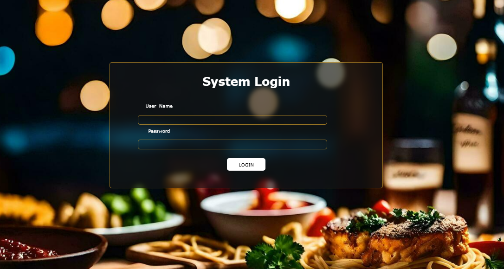
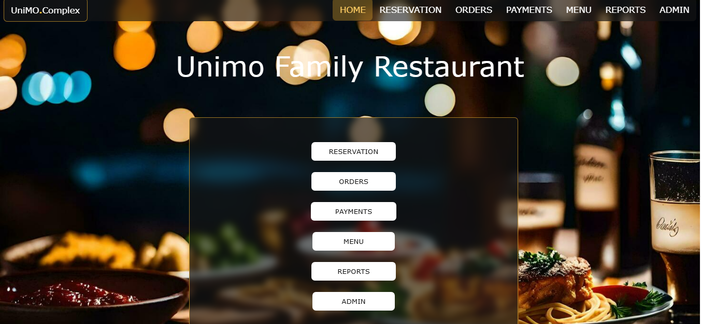
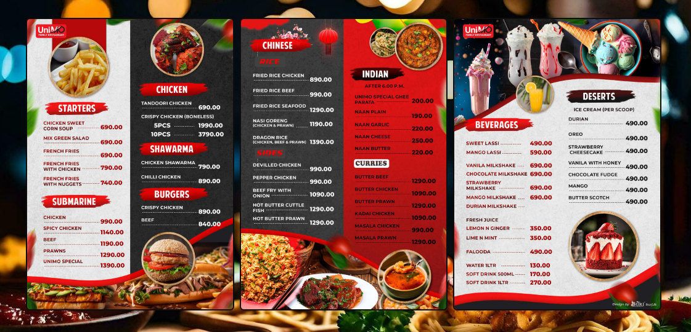
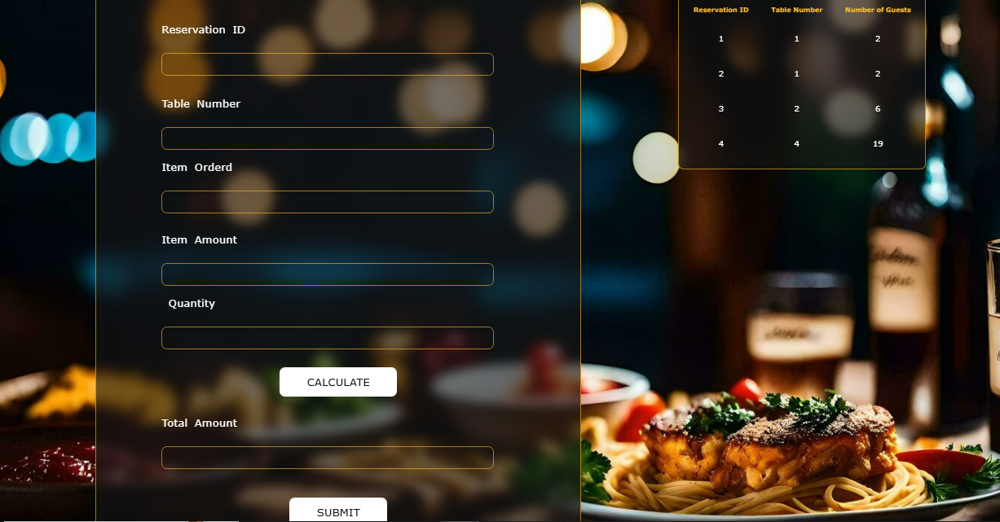
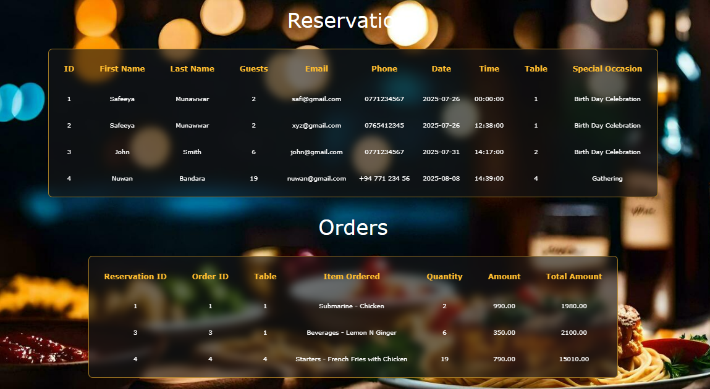

# 🍽️ Restaurant Management System

A full-featured **web-based restaurant management system** built using **HTML, CSS, JavaScript, PHP, and MySQL**. This system efficiently handles **reservations**, **orders**, **payments**, **menu items**, and **employee data**. Developed as a group project for the **ATI - Kandy - SLIATE - 2022 Batch**.

---

## 📋 Table of Contents

- [Features](#features)
- [Technologies Used](#technologies-used)
- [Database Structure](#database-structure)
- [Installation](#installation)
- [Usage](#usage)
- [Screenshots](#screenshots)
- [Contact](#contact)

---

## ✅ Features

- Manage table reservations with special occasion notes
- Handle customer orders by table
- Process payments (grand total, method)
- Manage menu items and prices
- Employee management (salary, hours, job title)
- Admin and user login panels

---

## 🛠️ Technologies Used

- **Frontend:** HTML, CSS, JavaScript
- **Backend:** PHP
- **Database:** MySQL (phpMyAdmin)
- **Local Server:** XAMPP

---

## 🗃️ Database Structure

### 1. `adminemployeenew`
| Column           | Description          |
|------------------|----------------------|
| employee_id      | Employee ID          |
| full_name        | Full Name            |
| date_of_birth    | Date of Birth        |
| address          | Address              |
| phone            | Phone Number         |
| email            | Email Address        |
| job_title        | Job Title            |
| hours_of_work    | Working Hours        |
| salary           | Salary               |

### 2. `menunew`
| Column         | Description   |
|----------------|---------------|
| item_id        | Menu Item ID  |
| item_category  | Category      |
| item_name      | Item Name     |
| item_price     | Price         |

### 3. `ordersnew`
| Column            | Description           |
|-------------------|-----------------------|
| reservation_id    | Reservation Reference |
| order_id          | Order ID              |
| item_ordered_name | Item Name             |
| quantity          | Quantity              |
| amount            | Amount per Item       |
| total_amount      | Total for Order       |

### 4. `paymentsnew`
| Column            | Description           |
|-------------------|-----------------------|
| reservation_id    | Reservation Reference |
| table_id          | Table Reference       |
| grandtotal_amount | Total Payment         |
| payment_method    | Cash / Card / Online  |

### 5. `reservationnew`
| Column           | Description              |
|------------------|--------------------------|
| first_name       | Customer First Name      |
| last_name        | Last Name                |
| numberofguests   | Number of Guests         |
| email            | Customer Email           |
| phone            | Contact Number           |
| date             | Reservation Date         |
| time             | Reservation Time         |
| table            | Table Number             |
| specialoccasion  | Occasion Info (if any)   |

### 6. `tablesnew`
| Column     | Description        |
|------------|--------------------|
| id         | Table Row ID       |
| table_id   | Table Number       |
| table      | Table Label        |
| status     | Availability Status|

---

## ⚙️ Installation

1. Clone the repository:
   - git clone https://github.com/J33WAKASUPUN/Restaurant Management 
     System.git
     
2. Install XAMPP from here if you don't have it installed.

3. Copy the project files to the htdocs directory in your XAMPP installation 
   directory.

4. Start Apache and MySQL from the XAMPP control panel.

5. Import the databases using phpMyAdmin:
    - Open http://localhost/phpmyadmin
      
    - Create new databases: adminemployeenew, menunew, ordersnew, 
      paymentsnew, reservationnew, tablesnew
      
    - Import the SQL files provided in the database directory of this 
      repository into their respective databases.

---

## 📷 Screenshots

### 🔹 Login

### 🔹 Dashboard

### 🔹 Menu 

### 🔹 Orders Page

### 🔹 Tables

---

## 🚀 Author
 **Safeeya Munawwar**
 

  
  
  
  

---

© 2024 Unimo Family Friendly Restaurant | Built with ❤️ using HTML, CSS, JavaScript, PHP, and MySQL
